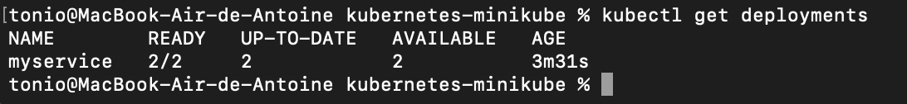
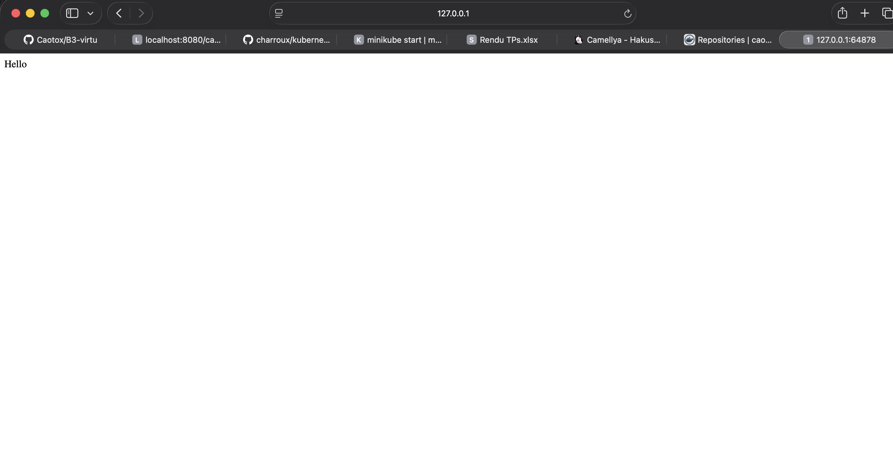
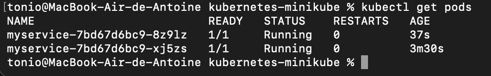
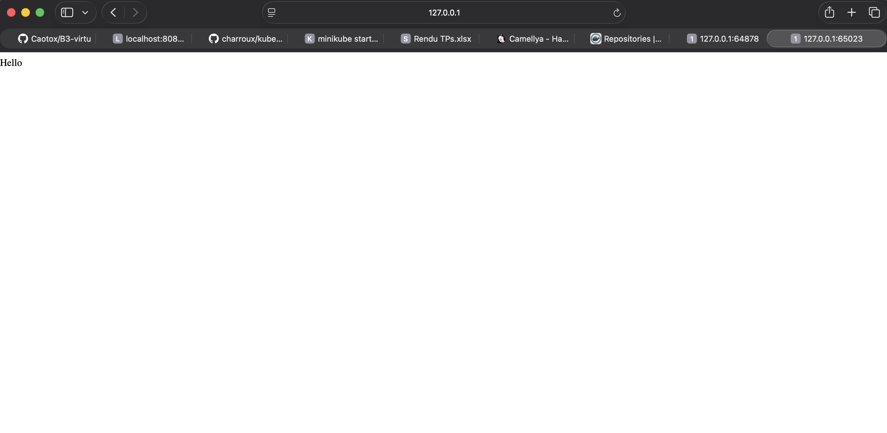
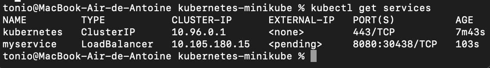
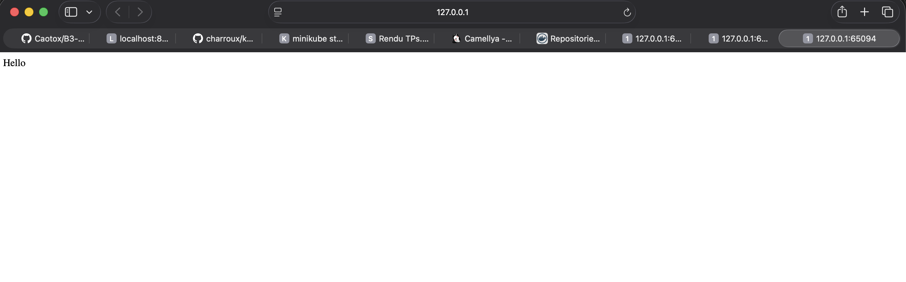
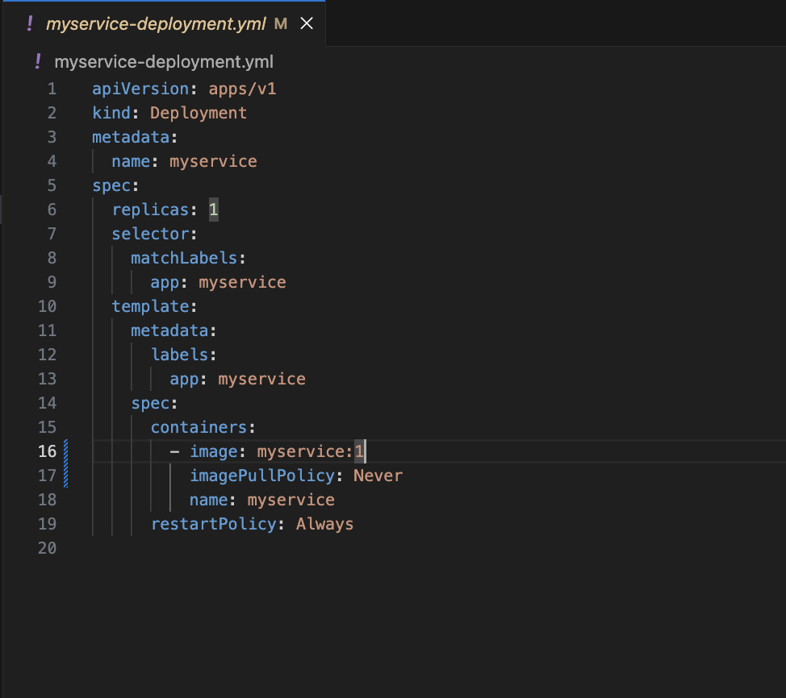
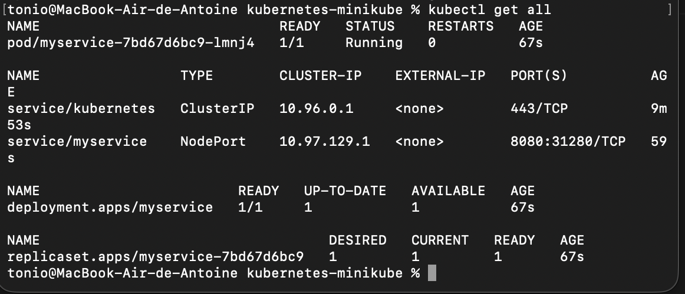
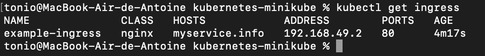
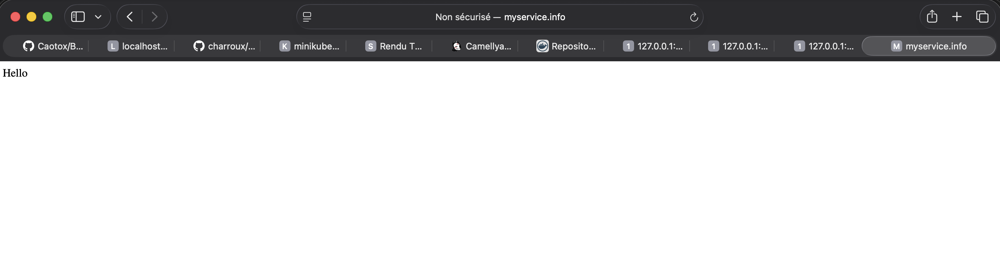

# Compte Rendu - TP Kubernetes avec Minikube

**Étudiant :** Antoine  
**Date :** 6 janvier 2026  
**Sujet :** Déploiement d'une application Java avec Kubernetes et Minikube

---

## Objectifs du TP

- Créer un déploiement Kubernetes à partir d'une image Docker personnelle
- Exposer un service via NodePort et LoadBalancer
- Effectuer du scaling et du load balancing
- Utiliser des fichiers YAML pour l'automatisation
- Configurer Ingress pour le routage par nom de domaine

---

## Lien GitHub du Projet

**Repository :** 

> **Note :** J'ai utilisé le projet https://github.com/charroux/kubernetes-minikube, en créant ma propre image et en l'utilisant pour Kubernetis ensuite. 

---

## Étapes Réalisées

### 1. Construction de l'Image Docker

L'application Java (MyService) a été compilée et une image Docker personnalisée a été créée :

```bash
# Compilation du projet Java
./gradlew build

# Construction de l'image dans l'environnement Docker de Minikube
eval $(minikube docker-env)
docker build -t myservice:1 .
```

**Adaptation :** Utilisation de l'image `myservice:1` au lieu de `efrei/myservice:1`

---

### 2. Création du Déploiement Kubernetes

Le déploiement a été créé avec l'image personnalisée :

```bash
kubectl create deployment myservice --image=myservice:1
kubectl patch deployment myservice -p '{"spec":{"template":{"spec":{"containers":[{"name":"myservice","imagePullPolicy":"Never"}]}}}}'
```

**Fichier YAML adapté :** [`myservice-deployment.yml`](myservice-deployment.yml)

```yaml
- image: myservice:1
  imagePullPolicy: Never
```

#### Screenshot #1 : Déploiement créé



*Commandes affichées :*
- `kubectl get deployments` → Montre le déploiement actif
- `kubectl get pods` → Montre le pod en état `Running`

---

### 3. Exposition du Service avec NodePort

Le service a été exposé en utilisant le type NodePort :

```bash
kubectl expose deployment myservice --type=NodePort --port=8080
minikube service myservice --url
```

**Résultat :** URL accessible sur `http://127.0.0.1:[PORT]`

#### Screenshot #2 : Service NodePort


*Terminal montrant l'URL du service*

#### Screenshot #3 : Test dans le navigateur



*Le service affiche "Hello" correctement*

---

### 4. Scaling et Load Balancing

Le déploiement a été scalé à **2 replicas** :

```bash
kubectl scale --replicas=2 deployment/myservice
kubectl get deployments
kubectl get pods
```

Le service NodePort distribue automatiquement la charge entre les 2 instances.

#### Screenshot #4 : Scaling à 2 replicas



*Affichage montrant :*
- `READY 2/2` dans les déploiements
- 2 pods en état `Running`


---

### 5. Service de Type LoadBalancer

Le service a été reconfiguré en LoadBalancer :

```bash
kubectl delete service myservice
kubectl expose deployment myservice --type=LoadBalancer --port=8080
kubectl get services
```

**Résultat :** Service de type `LoadBalancer` avec EXTERNAL-IP en `<pending>` (normal sur Minikube)

#### Screenshot #5 : LoadBalancer



*Commande `kubectl get services` montrant TYPE=LoadBalancer*


---

### 6. Déploiement via Fichiers YAML

Les ressources ont été supprimées puis recréées avec des fichiers YAML :

```bash
kubectl delete service myservice
kubectl delete deployment myservice
kubectl apply -f myservice-deployment.yml
kubectl apply -f myservice-service.yml
```

**Avantages :**
- Infrastructure as Code
- Reproductibilité
- Versioning avec Git

#### Screenshot #6 : Déploiement YAML



*Fichier `myservice-deployment.yml` avec l'image personnalisée*

#### Screenshot #7 : Ressources créées via YAML



*Commande `kubectl get all` montrant toutes les ressources*

---

### 7. Configuration d'Ingress

Ingress permet d'exposer plusieurs services sous un même point d'entrée avec des règles de routage.

#### 7.1 Activation du contrôleur Ingress

```bash
minikube addons enable ingress
kubectl get pods -n ingress-nginx
```

#### 7.2 Application du fichier Ingress

```bash
kubectl apply -f ingress.yml
kubectl get ingress
```

**Configuration :** Routage de `myservice.info` vers le service `myservice`

#### 7.3 Configuration du fichier hosts

```bash
echo "127.0.0.1 myservice.info" | sudo tee -a /etc/hosts
```

#### 7.4 Activation du tunnel Minikube

```bash
minikube tunnel
```

#### Screenshot #8 : Ingress configuré



*Affichage montrant l'Ingress*

#### Screenshot #9 : Accès via nom de domaine



*Navigateur affichant "Hello" via `http://myservice.info/`*

---