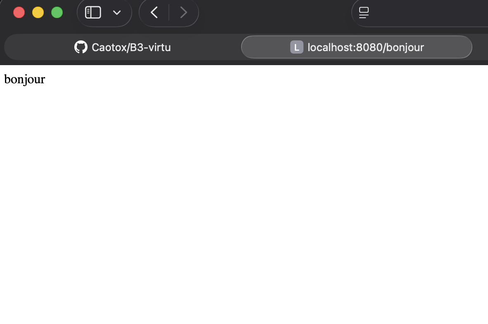
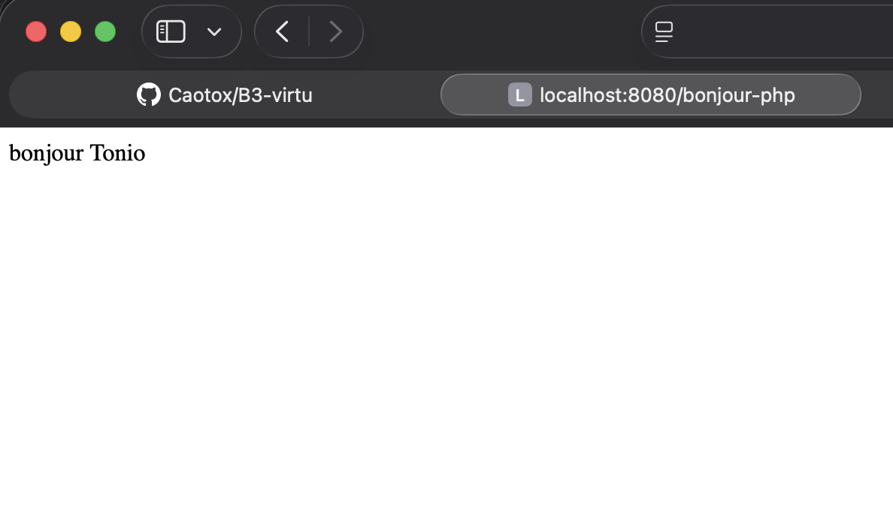
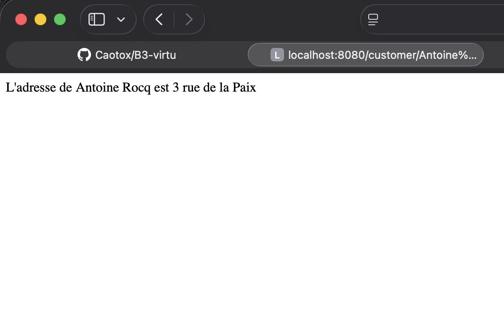
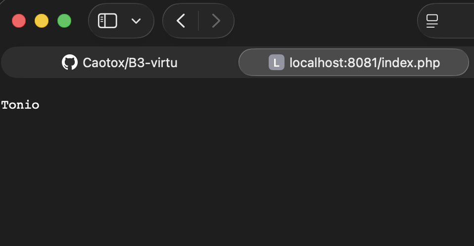
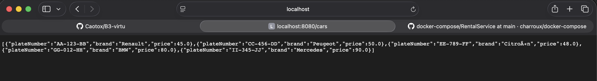
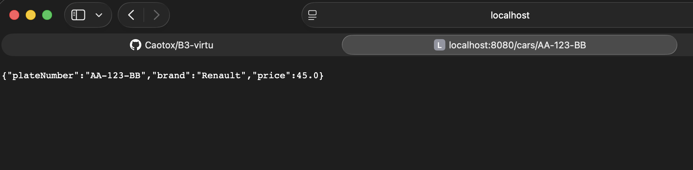

Antoine ROCQ

#Liste des commandes effectuées :
Après l'installation de Java, puis :
```bash
cd RentalService
./gradlew build
```
Puis :
```java
java -jar build/libs/RentalService-0.0.1-SNAPSHOT.jar  
```
Et accéder à :
http://localhost:8080/bonjour

Après cela, on reste dans RentalService et :
```bash
touch Dockerfile
nano Dockerfile
```
Et on y met le contenu suivant :
```java
FROM eclipse-temurin:21-jre-jammy
VOLUME /tmp
EXPOSE 8080
ADD ./build/libs/RentalService-0.0.1-SNAPSHOT.jar app.jar
ENTRYPOINT ["java","-Djava.security.egd=file:/dev/./urandom","-jar","/app.jar"]
```
Ensuite :
```bash
docker build –t rental-virtu .
```
Et enfin :
```bash
docker run -p 8080:8080 rental-virtu
```
Et accéder à :
http://localhost:8080/bonjour

## Microservice PHP

Création du dossier PHPService :
```bash
mkdir PHPService
cd PHPService
```

Création du fichier index.php :
```bash
touch index.php
nano index.php
```
Et on y met le contenu suivant :
```php
<?php
header('Content-Type: application/json');

$response = [
    "prenom" => "Antoine",
    "message" => "Bonjour ! Mon prenom est Antoine"
];

echo json_encode($response);
?>
```

Création du Dockerfile :
```bash
touch Dockerfile
nano Dockerfile
```
Et on y met le contenu suivant :
```dockerfile
FROM php:8.2-apache

COPY index.php /var/www/html/

EXPOSE 80
```

Construction de l'image Docker :
```bash
docker build -t phpservice .
```

Test du service :
```bash
docker run -p 8080:80 phpservice
```
Et accéder à :
http://localhost:8080/index.php

Publication sur Docker Hub :
```bash
docker login
docker tag phpservice:latest caotox/phpservice:latest
docker push caotox/phpservice:latest
```

## Communication entre microservices

Modification du fichier BonjourController.java pour ajouter la route /bonjour-php :
```bash
nano RentalService/src/main/java/com/ingnum/rentalservice/controller/BonjourController.java
```

Rebuild du projet Java :
```bash
cd RentalService
./gradlew clean build
```

Création du docker-compose.yml à la racine :
```bash
cd ..
touch docker-compose.yml
nano docker-compose.yml
```
Et on y met le contenu suivant :
```yaml
version: '3.8'

services:
  rental-service:
    build: ./RentalService
    container_name: rental-service
    ports:
      - "8080:8080"
    networks:
      - app-network
    depends_on:
      - php-service

  php-service:
    build: ./PHPService
    container_name: php-service
    ports:
      - "8081:80"
    networks:
      - app-network

networks:
  app-network:
    driver: bridge
```

Lancement des services avec docker-compose :
```bash
docker-compose up --build
```

Tests :
- http://localhost:8080/bonjour
- http://localhost:8081/index.php
- http://localhost:8080/bonjour-php (communication Java -> PHP)

Arrêter les conteneurs :
```bash
docker-compose down
```

Mise à jour de l'image Java sur Docker Hub :
```bash
docker build -t caotox/rental-service:latest ./RentalService
docker push caotox/rental-service:latest
```

## Communication entre vos deux microservices via HTTP

Modification du fichier application.properties pour ajouter l'URL du service PHP :
```bash
nano RentalService/src/main/resources/application.properties
```
Et on y ajoute :
```properties
customer.service.url=http://php-service
```

Modification du BonjourController.java pour ajouter la communication HTTP :
```bash
nano RentalService/src/main/java/com/ingnum/rentalservice/controller/BonjourController.java
```
Et on y ajoute :
```java
@Value("${customer.service.url}")
private String customerServiceUrl;

@GetMapping("/bonjour-php")
public String bonjourPhp() {
    RestTemplate restTemplate = new RestTemplate();
    String name = restTemplate.getForObject(customerServiceUrl, String.class);
    return "bonjour " + name;
}
```

Rebuild du projet :
```bash
cd RentalService
./gradlew clean build
```

Reconstruction et relancement des conteneurs :
```bash
cd ..
docker-compose up --build
```

Test de la communication HTTP entre microservices :
- http://localhost:8080/bonjour-php (Java appelle PHP via HTTP)

## Résumé des rendus :

Voici le code principal, à savoir le controller de la partie Java de notre projet. Elle va permettre d'implémenter ces 3 routes :

- http://localhost:8080/bonjour




- http://localhost:8080/bonjour-php



- http://localhost:8080/customer/Antoine%20Rocq



- http://localhost:8081/index.html




Le fonctionnement est simple. 
- Pour la route "bonjour", on va simplement renvoyer "bonjour".
- Pour la route "bonjour-php", on va renvoyer bonjour suivi de name. Cette variable name est également présente dans la route "customer/{name}". Ces deux routes vont faire un appel HTTP, qui va être gêré par notre service PHP. Le service PHP va analyser la requête (url de notre navigateur), et renvoyer une valeur de name différente selon la route appelée (donc selon le pattern d'url identifié). Pour la route "bonjour-php", on renverra simplement "Tonio", parce que le return de la méthode a déjà 'bonjour' à quoi on ajoute le name (qui vient d'être récupéré), et pour la route "customer/{name}", on renverra tout le message directement car le return de la méthode concerne tout le retour du fichier PHP. ("L'adresse de Antoine Rocq est 3 rue de la Paix")
- Dans la même idée, le else de index.html permet également, lorsqu'on accède à l'url "index.html" avec le port "8081" (donc "http://localhost:8081/index.html") d'afficher seulement Tonio (et pas le bonjour, car on ne passe pas par l'application Java, le controller, et donc le return avec le bonjour)

## Ajout d'une BDD 

Pour l'ajout de la BDD, j'ai tout d'abord ajouté un model Car, puis un repository. Pour les méthodes CRUD, j'utilise simplement Spring, donc pas besoin de les implémenter niveau code. 
Avec le controller lors de l'initialisation si la table est vide, on ajoute des valeurs dans la table voiture avec la méthode "save".
A partir de là, dans le controller 2 méthodes ont été ajoutées :
- "/cars" -> récupère et affiche les informations de toute les voitures
- "/cars/{plate}" -> récupère et affiche les information de la voiture correspondant à la plaque 
(voir captures d'écran ci jointes)

- http://localhost:8080/cars



- http://localhost:8080/cars/{plate}


## Déploiement sur Kubernetes

### Prérequis
- Kubernetes installé (Docker Desktop, Minikube, etc.)
- kubectl configuré
- Images Docker buildées

### Construction des images Docker

Avant de déployer sur Kubernetes, il faut construire les images Docker :

```bash
# Build de l'image RentalService
cd RentalService
./gradlew build
docker build -t tonio/rental-service:latest .

# Build de l'image PHPService
cd ../PHPService
docker build -t tonio/php-service:latest .
cd ..
```

### Déploiement avec Kubernetes

Le fichier `kubernetes-deployment.yml` contient la configuration complète pour déployer l'application sur Kubernetes avec :
- Un déploiement MySQL avec son service (ClusterIP)
- Un déploiement PHP avec son service (ClusterIP)
- Un déploiement RentalService avec son service (LoadBalancer)

Pour déployer l'application sur Kubernetes :

```bash
# Appliquer la configuration Kubernetes
kubectl apply -f kubernetes-deployment.yml

# Vérifier le statut des pods
kubectl get pods

# Vérifier le statut des services
kubectl get services

# Attendre que tous les pods soient en état "Running"
kubectl wait --for=condition=ready pod -l app=rental-service --timeout=300s
```

### Accès aux services

Avec Kubernetes, les URLs changent :
- Pour accéder au RentalService depuis l'extérieur : utiliser l'IP du service LoadBalancer
  ```bash
  kubectl get service rental-service
  ```
- Sur Docker Desktop ou Minikube, utiliser : `http://localhost:8080`

### Différences avec Docker Compose

**Configuration des URLs (application.properties) :**
- Docker Compose : `jdbc:mysql://localhost:3307/...` (mapping de port)
- Kubernetes : `jdbc:mysql://rental-mysql-service:3306/...` (nom du service)

**Résolution DNS :**
- Docker Compose : résolution par nom de conteneur
- Kubernetes : résolution par nom de service (DNS interne au cluster)

### Commandes utiles

```bash
# Voir les logs d'un pod
kubectl logs -f <nom-du-pod>

# Supprimer tous les déploiements
kubectl delete -f kubernetes-deployment.yml

# Redémarrer un déploiement
kubectl rollout restart deployment/rental-service-deployment
```